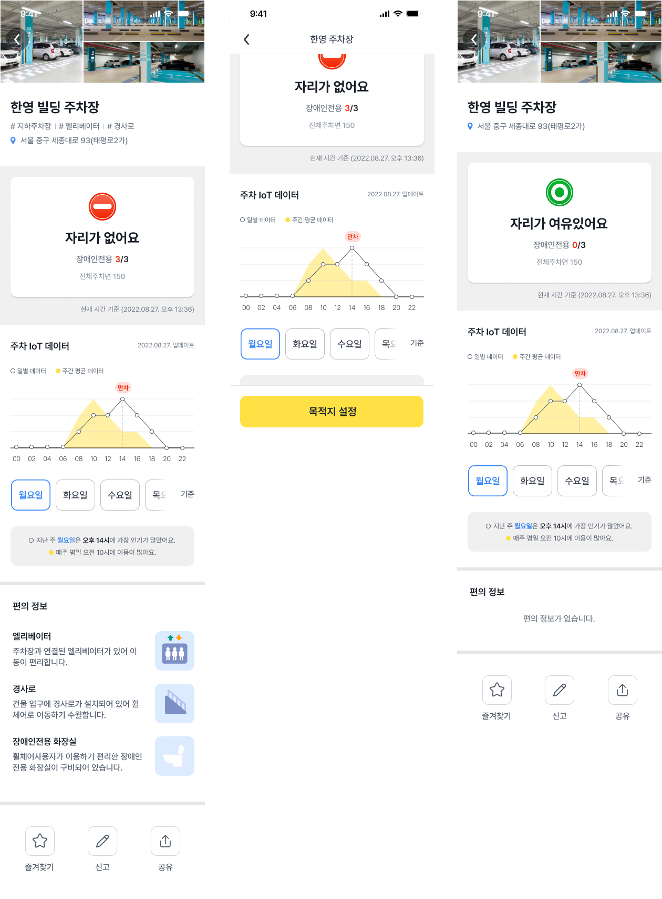

# Bmap-Android-Flutter-Ui
> B-Map: 장애인 전용 주차구역 안내 서비스 Android

## 앱 디자인


## 라이브러리 설치

Flutter Android 프로젝트의 경우 Android Studio에서 잡아버리면 꼬이기 때문에 루트 프로젝트 디렉터리 상위에 두고 사용한다.

./project/settings.gradle

```gradle
dependencyResolutionManagement {
    repositoriesMode.set(RepositoriesMode.PREFER_PROJECT)
    repositories {
        google()
        mavenCentral()
        // BMap Flutter Ui Library 사용
        maven {
            url '../android.app.bmap.ui.lib/repo'
        }
        // Flutter
        maven {
            url 'https://storage.googleapis.com/download.flutter.io'
        }
    }
}
```
./project/app/build.gradle
```gradle
android {
  ...
  android {
    buildTypes {
       profile {
         initWith debug
       }
    }
  }
}

dependencies {
   ...
   debugImplementation 'bmap.ui:flutter_debug:1.0'
   profileImplementation 'bmap.ui:flutter_profile:1.0'
   releaseImplementation 'bmap.ui:flutter_release:1.0'
}
```
## 라이브러리 사용
Flutter 라이브러리의 경우 바로 사용하기에는 귀찮은점이 많아 외부 Extension으로 분리작업을 진행했다.


```kt
// FlutterExtensions.kt

package android.app.bmap.ui.lib

import android.content.Context
import android.content.Intent
import com.google.gson.Gson
import io.flutter.embedding.android.FlutterActivity
import io.flutter.embedding.engine.FlutterEngine
import io.flutter.embedding.engine.FlutterEngineCache
import io.flutter.embedding.engine.dart.DartExecutor
import io.flutter.plugin.common.MethodCall
import io.flutter.plugin.common.MethodChannel
import kotlinx.coroutines.CoroutineScope
import kotlinx.coroutines.Dispatchers
import kotlinx.coroutines.launch

object FlutterExtensions {
    /**
     *
     * ROUTES
     *
     */
    private const val ROUTE_INIT = "/"
    private const val ROUTE_LIKE = "/like";
    private const val ROUTE_PARKING = "/parking";
    private lateinit var searchAddressResult: MethodChannel.Result

    /**
     *
     * DATA CLASS
     *
     */
    data class LikeItem(
        val type: String, val likeName: String, val likeAddress: String
    )

    /**
     *
     * Navigator Extensions
     *
     */

    // Initialize
    fun Context.setupFlutterNavigation() {
        setupNavigation(ROUTE_LIKE)
        setupNavigation(ROUTE_PARKING)
    }


    fun launchLikeFinished(address: String) {
        searchAddressResult.success(mapOf("address" to address))
    }


    fun Context.launchLike(
        onLaunchSearchAddress: (String) -> Unit,
        onUpdateLikeList: (List<LikeItem>) -> Unit
    ) {
        flutterNavigationTo(ROUTE_LIKE) { call, res ->
            when (call.method) {
                // 주소 검색
                "searchAddress" -> {
                    val arguments = call.arguments as Map<*, *>
                    searchAddressResult = res
                    onLaunchSearchAddress(arguments["address"]?.toString() ?: "")
                }
                // 즐겨찾기 목록 전달
                "saveAddress" -> {
                    val arguments = call.arguments as List<*>
                    val args =
                        arguments.map { Gson().fromJson(it.toString(), LikeItem::class.java) }
                    onUpdateLikeList(args)
                    res.success(true)
                }
            }
        }
    }

    fun Context.launchParking(data: String, onLaunchReport: () -> Unit) {
        val rawData: String = data
        flutterNavigationTo(ROUTE_PARKING) { call, res ->
            when (call.method) {
                "loadData" -> {
                    res.success(rawData);
                }
                "launchReport" -> {
                    onLaunchReport()
                    res.success(true);
                }
            }
        }
    }

    private fun Context.setupNavigation(path: String) {
        val flutterEngine = FlutterEngine(this)
        flutterEngine.navigationChannel.setInitialRoute(path)
        flutterEngine.dartExecutor.executeDartEntrypoint(DartExecutor.DartEntrypoint.createDefault())
        FlutterEngineCache.getInstance().put(path, flutterEngine)
    }

    private fun Context.flutterNavigationTo(
        path: String,
        callback: suspend (MethodCall, MethodChannel.Result) -> Unit
    ) {
        val flutterEngine =
            FlutterEngineCache.getInstance().get(path)
                ?: throw java.lang.NullPointerException("Flutter 초기화가 수행되지 않았습니다")
        MethodChannel(flutterEngine.dartExecutor, path).setMethodCallHandler { call, res ->
            CoroutineScope(Dispatchers.Main).launch {
                callback.invoke(call, res)
            }
        }
        startActivity(FlutterActivity.withCachedEngine(path).build(this).apply {
            flags = Intent.FLAG_ACTIVITY_NEW_TASK
        })
    }
}
```
### Sample
```kt
setupFlutterNavigation()
launchParking(
    """
        {
           "parkCode":"100-1-000017",
           "parkName":"관철동",
           "newAddr":"서울특별시 종로구 청계천로 83,",
           "latitude":37.5684501,
           "longitude":126.9845248
        }
    """.trimIndent(),
    onLaunchReport = {
        Log.d("onLaunchReport", "onLaunchReport")
    }
)
```
